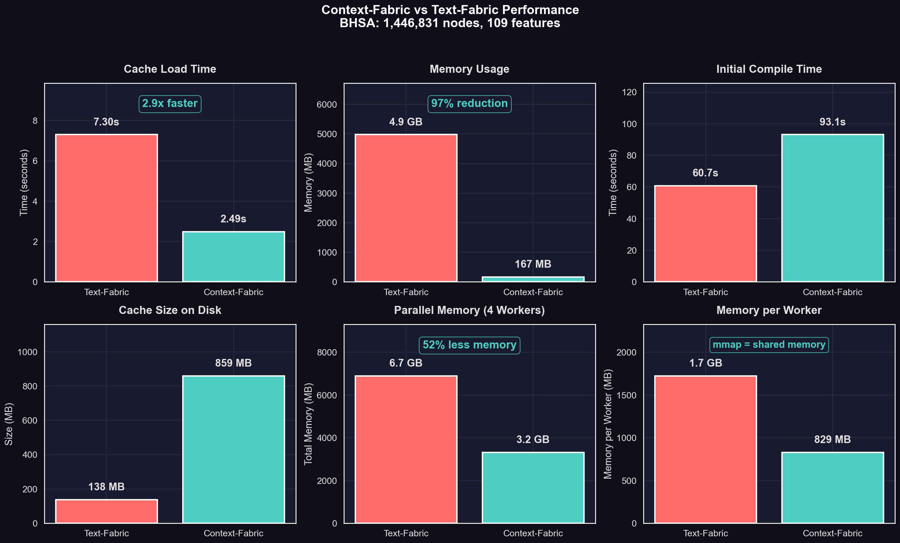

<p align="center">
  
</p>

<h1 align="center">Context-Fabric</h1>

<p align="center">A graph-based corpus engine for annotated text with efficient traversal and search.</p>

## Overview

Context-Fabric provides a powerful data model for working with annotated text corpora as graphs. It enables efficient navigation, feature lookup, and pattern-based search across large textual datasets.

Forked from Dirk Roorda's [Text-Fabric](https://github.com/annotation/text-fabric).

## Installation

```bash
pip install context-fabric
```

## Quick Start

```python
from cfabric.core import Fabric

# Load a dataset
TF = Fabric(locations='path/to/data')
api = TF.load('feature1 feature2')

# Navigate nodes
for node in api.N():
    print(api.F.feature1.v(node))

# Use locality
embedders = api.L.u(node)
embedded = api.L.d(node)
```

## Core API

- **N** (Nodes) - Walk through nodes in canonical order
- **F** (Features) - Access node feature values
- **E** (Edges) - Access edge feature values
- **L** (Locality) - Navigate between related nodes
- **T** (Text) - Retrieve text representations
- **S** (Search) - Search using templates

## Performance

Context-Fabric uses memory-mapped numpy arrays for dramatically faster loading and reduced memory consumption compared to Text-Fabric's pickle-based caching.

### Benchmarks (BHSA Hebrew Bible corpus — 1.4M nodes, 109 features)

| Metric | Text-Fabric | Context-Fabric | Improvement |
|--------|-------------|----------------|-------------|
| **Load Time** | 7.0s | 2.4s | **2.9x faster** |
| **Memory Usage** | 6.1 GB | 1.6 GB | **74% reduction** |
| Compile Time | 7s | 91s | 13x slower |
| Cache Size | 138 MB | 859 MB | 6.2x larger |

<p align="center">
  
</p>

The key insight: **compilation happens once, loading happens every session**. Context-Fabric optimizes for the common case with:

- **Memory-mapped arrays**: Data stays on disk, accessed on-demand
- **Efficient sparse iteration**: Uses numpy vectorized operations instead of Python loops
- **Cached materialization**: Dictionary views computed once per session

### Parallel Worker Scaling

Memory-mapped arrays enable efficient parallel processing. Multiple workers share the same mmap'd data instead of each loading a full copy into RAM.

**Spawn mode** (cold start — each worker loads independently):

| Metric | Text-Fabric | Context-Fabric | Savings |
|--------|-------------|----------------|---------|
| Total (4 workers) | 9.8 GB | 3.3 GB | **66% less** |
| Per worker | 2.5 GB | 821 MB | **3x less** |

**Fork mode** (API scenario — pre-load then fork workers):

| Metric | Text-Fabric | Context-Fabric | Savings |
|--------|-------------|----------------|---------|
| Total (4 workers) | 5.8 GB | 440 MB | **92% less** |
| Per worker | 1.5 GB | 110 MB | **13x less** |

*Measured with USS (Unique Set Size) which correctly excludes shared mmap pages.*

Run the benchmark yourself:

```bash
python benchmarks/compare_performance.py --source path/to/tf/data --workers 4
```

## Testing

See [TESTING.md](TESTING.md) for how to run tests.

## Authors

- Cody Kingham
- Dirk Roorda

## License

MIT License - see [LICENSE](LICENSE) for details.
