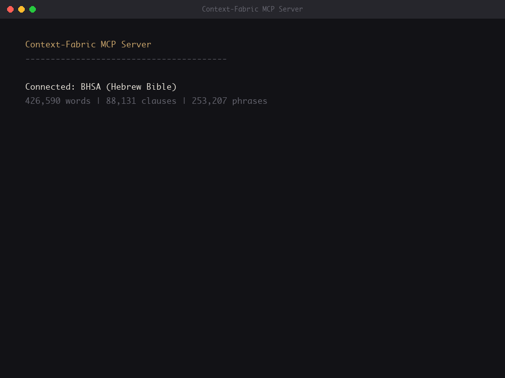
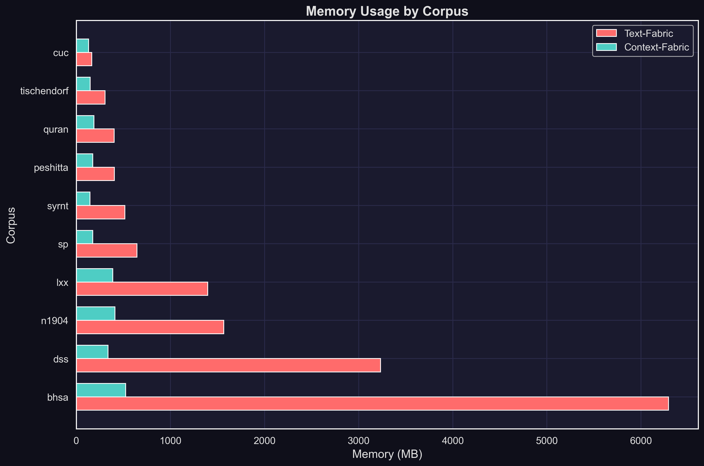

<p align="center">
  
</p>

<h1 align="center">Context-Fabric</h1>

<p align="center">
  <strong>Production-ready corpus analysis for the age of AI</strong>
</p>

<p align="center">
  <a href="https://pypi.org/project/context-fabric/"></a>
  <a href="https://pypi.org/project/context-fabric/"></a>
  <a href="https://github.com/Context-Fabric/context-fabric/actions"></a>
  <a href="https://github.com/Context-Fabric/context-fabric/blob/master/LICENSE"></a>
</p>

<p align="center">
  
</p>

<p align="center">
  <em>AI agents analyzing ancient Hebrew text via the Model Context Protocol</em>
</p>

---

## Overview

Context-Fabric brings corpus analysis into the AI era. Built on the proven [Text-Fabric](https://github.com/annotation/text-fabric) data model, it introduces a memory-mapped architecture enabling parallel processing for production deployments—REST APIs, multi-worker services, and AI agent tools via MCP.

<table>
<tr>
<td width="50%">

### Built for Production
Memory-mapped arrays enable true parallelization. Multiple workers share data instead of duplicating it.

</td>
<td width="50%">

### AI-Native
MCP server exposes corpus operations to Claude, GPT, and other LLM-powered tools.

</td>
</tr>
<tr>
<td width="50%">

### Powerful Data Model
Standoff annotation, graph traversal, pattern search, and arbitrary feature annotations.

</td>
<td width="50%">

### Dramatic Efficiency
3.5x faster loads, 65% less memory in single process, 62% less with parallel workers.

</td>
</tr>
</table>

---

## MCP Server for AI Agents

Context-Fabric includes **cfabric-mcp**, a Model Context Protocol server that exposes corpus operations to AI agents:

```bash
# Start the MCP server
cfabric-mcp --corpus /path/to/bhsa

# Or with SSE transport for remote clients
cfabric-mcp --corpus /path/to/bhsa --sse 8000
```

The server provides 10 tools for discovery, search, and data access—designed for iterative, token-efficient agent workflows.

→ [MCP Server Documentation](libs/mcp/README.md)

---

## Memory Efficiency

Text-Fabric loads entire corpora into memory—effective for single-user research, but each parallel worker duplicates that memory footprint. Context-Fabric's memory-mapped arrays change the equation:

| Scenario | Memory Reduction |
|----------|------------------|
| Single process | 65% less |
| 4 workers (spawn) | 62% less |
| 4 workers (fork) | 62% less |

*Mean reduction across 10 corpora. Memory measured as total RSS after loading from cache.*

---

## Installation

```bash
# Core library
pip install context-fabric

# With MCP server
pip install context-fabric[mcp]
```

## Quick Start

```python
from cfabric.core import Fabric

# Load a corpus
CF = Fabric(locations='path/to/corpus')
api = CF.load('feature1 feature2')

# Navigate nodes
for node in api.N.walk():
    print(api.F.feature1.v(node))

# Traverse structure
embedders = api.L.u(node)  # nodes containing this node
embedded = api.L.d(node)   # nodes within this node

# Search patterns
results = api.S.search('''
clause
  phrase function=Pred
    word sp=verb
''')
```

## Core API

| API | Purpose |
|-----|---------|
| **N** | Walk nodes in canonical order |
| **F** | Access node features |
| **E** | Access edge features |
| **L** | Navigate locality (up/down the hierarchy) |
| **T** | Retrieve text representations |
| **S** | Search with structural templates |

---

## Performance

Context-Fabric trades **one-time compilation cost** for **dramatic runtime efficiency**. Compile once, benefit forever.

| Metric | Mean Improvement |
|--------|------------------|
| Load time | 3.5x faster |
| Memory (single) | 65% less |
| Memory (spawn) | 62% less |
| Memory (fork) | 62% less |

*Mean across 10 corpora. The larger cache enables memory-mapped access—no deserialization, instant loads, shared memory across workers.*

<p align="center">
  
</p>

Run benchmarks yourself:

```bash
pip install context-fabric[benchmarks]
cfabric-bench memory --corpus path/to/corpus
```

---

## Packages

| Package | Description |
|---------|-------------|
| [context-fabric](libs/core/) | Core graph engine |
| [cfabric-mcp](libs/mcp/) | MCP server for AI agents |
| [cfabric-benchmarks](libs/benchmarks/) | Performance benchmarking suite |

## Links

- [Core Changelog](libs/core/CHANGELOG.md)
- [MCP Changelog](libs/mcp/CHANGELOG.md)
- [Benchmarks Changelog](libs/benchmarks/CHANGELOG.md)
- [Testing Guide](TESTING.md)

## Authors

Context-Fabric by [Cody Kingham](https://github.com/codykingham), built on [Text-Fabric](https://github.com/annotation/text-fabric) by [Dirk Roorda](https://github.com/dirkroorda).

## License

MIT
